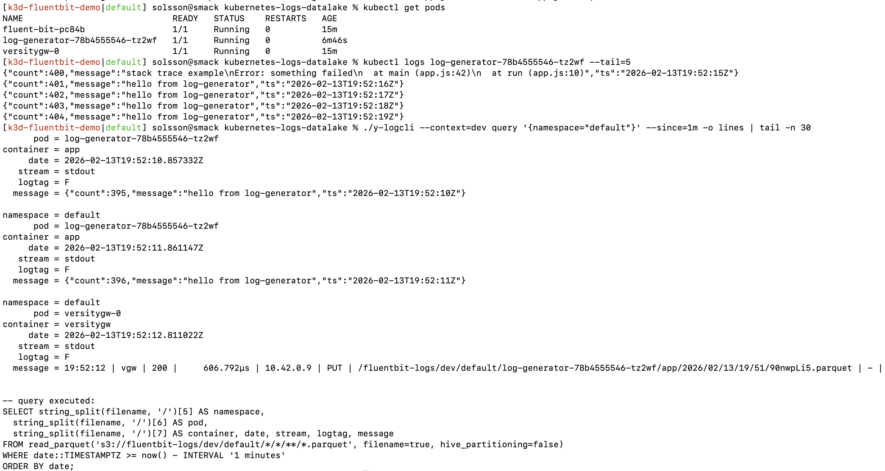

# kubernetes-logs-datalake



Fluent Bit DaemonSet that collects Kubernetes container logs and writes them as Parquet files to S3-compatible storage.

## Build

The `build/` directory contains a Dockerfile that compiles Fluent Bit v4.2.2 with Apache Arrow/Parquet support (`FLB_ARROW=On`) on a distroless debian13 nonroot runtime.

```bash
docker build -t yolean/fluentbit:latest build/
```

## Example

The `example/` directory provides a complete k3d-based demo: container log forwarding via a DaemonSet, writing parquet files to [versitygw](https://github.com/versity/versitygw) (S3-compatible gateway).

### Prerequisites

- [k3d](https://k3d.io/)
- Docker
- kubectl

### Run

```bash
cd example
bash setup.sh
```

This will:
1. Create a k3d cluster `fluentbit-demo`
2. Import the locally built `yolean/fluentbit:latest` image
3. Deploy versitygw (S3-compatible storage with posix backend)
4. Create the `fluentbit-logs` S3 bucket
5. Deploy the Fluent Bit DaemonSet (tail → kubernetes filter → S3 parquet output)
6. Deploy a busybox log-generator that emits JSON every second

If setup completes it will print test instructions.

### Teardown

```bash
bash teardown.sh
```

### Data flow

```
busybox (log-generator) → stdout JSON
  → /var/log/containers/*.log (k3d node)
  → fluent-bit tail input → kubernetes filter → S3 output (parquet)
  → versitygw:7070 → /data/fluentbit-logs/
```
